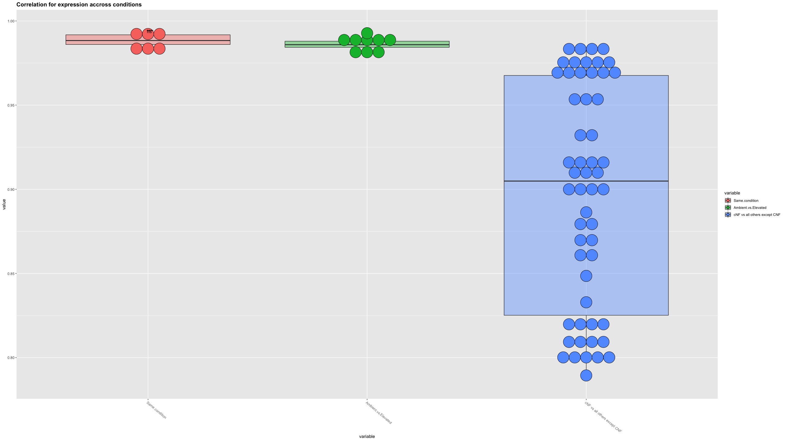
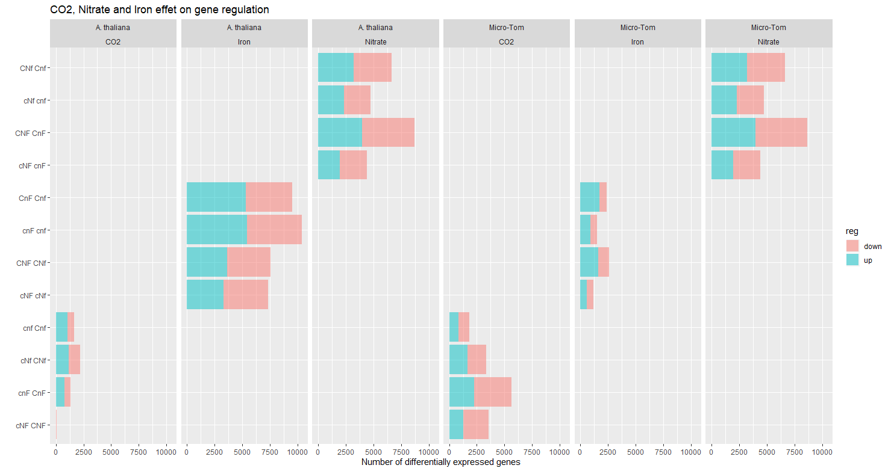
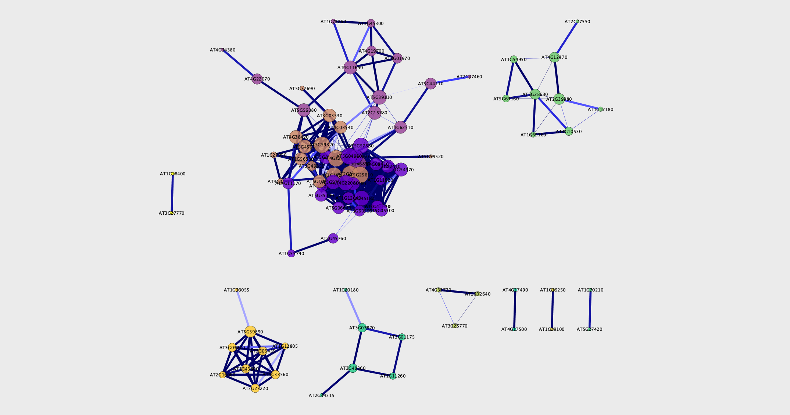

On cherche à étudier l'effet de trois facteurs sur le transcriptome des racines d'Arabidopsis thaliana et de la micro Tomate.

```{r knitr_init, echo=FALSE, cache=FALSE}
library(knitr, warn.conflicts = F, quietly = T)
library(rmdformats, warn.conflicts = F, quietly = T)

## Global options
options(max.print="75")
opts_chunk$set(cache=FALSE,
               prompt=FALSE,
               tidy=TRUE,
               comment=NA,
               message=FALSE,
               warning=FALSE,
               fig.align = "center")
opts_knit$set(width=75)
setwd("~/Documents/CombinatoireFeNCO2/Combinatoire/")
library(gridExtra)
library(reshape2)
library(PLNmodels)
suppressMessages(library(gridExtra, warn.conflicts = F, quietly = T))
suppressMessages(library(stringr, warn.conflicts = F, quietly = T))
suppressMessages(library(ggpubr, warn.conflicts = F, quietly = T))
suppressMessages(library(ggplot2, warn.conflicts = F, quietly = T))
suppressMessages(library(clusterProfiler, warn.conflicts = F, quietly = T))
suppressMessages(library(enrichplot, warn.conflicts = F, quietly = T))
suppressMessages(library(ggpubr, warn.conflicts = F, quietly = T))
suppressMessages(library(psych, warn.conflicts = F, quietly = T))
suppressMessages(library(igraph, warn.conflicts = F, quietly = T))
#self written functions for differential expression
source("./DEFunctions.R")

specie = "At"
```

# CO2

## Clustering

```{r cluster}
load(paste0("./GenesCO2_",specie,".RData"))


load("./normalized.count_At.RData")

#quantification file
data <- read.csv("quantifFiles/QuantifGenes.csv", h = T, sep = ',')
rownames(data) <- data$Gene
genes = which(!(grepl("__", rownames(data))))
not_quant = data[which((grepl("__", rownames(data)))),]
data = data[genes,grepl('R', colnames(data))]

keep <- rowSums(data) >= 10
data <- data[keep,]
group <- sapply(colnames(data), getLabel, with.rep = F)
colnames(data) <- sapply(colnames(data), getLabel)

specie = "At"
clusteredGenes <- clustering(sharedBy3, data)

a <- OntologyProfile(sharedBy3)
a$cluster <- clusteredGenes[a$ensembl_gene_id]

entrezID <- list()
nb_clust = max(clusteredGenes)
for (clust in seq(1:nb_clust)) {
    # print(entrez[entrez$cluster == clust,]$ensembl_transcript_id)
    entrezID[[length(entrezID) + 1]] <- na.omit(a[a$cluster == clust, ]$entrezgene_id)
}
names(entrezID) <- as.character(seq(1:nb_clust))

ck <- compareCluster(geneCluster = entrezID, fun = "enrichGO", OrgDb = org.At.tair.db, ont = "BP", pAdjustMethod = "BH", 
    pvalueCutoff = 0.01, qvalueCutoff = 0.05)

clusterProfiler::dotplot(ck, x = ~Cluster)


# On essaie un autre clustering avec lka librarie MPLN
#mpln (dataset = as.matrix(data[sharedBy3,]))
#beaucoup trop long, même mutlithreadé, c'est n'imp
```

Model-Based Clustering Using MPLN (Parallelized)
Description
Performs clustering using mixtures of multivariate Poisson-log normal (MPLN) distribution and model selection using AIC, AIC3, BIC and ICL. Since each component/cluster size (G) is independent from another, all Gs in the range to be tested have been parallelized to run on a seperate core using the parallel R package.


## Visualisation en ACP

```{r acp}

ACP(normalized.count[sharedBy3,], clusteredGenes)

```

## Réseau 

```{r net}

log.data <- log2(normalized.count[sharedBy3,]+1)


Norm.interest.corr<-corr.test(t(log.data), method="pearson", ci=F)
Norm.interest.corr$p[lower.tri( Norm.interest.corr$p,diag=-TRUE)]=NA
Pval.adj<- as.data.frame(as.table(Norm.interest.corr$p))
Norm.interest.corr$r[lower.tri(Norm.interest.corr$r,diag=TRUE)]=NA
Correlation<-  as.data.frame(as.table(Norm.interest.corr$r))
Cor.table<- na.exclude(cbind( Correlation, Pval.adj))[,c(1,2,3,6)]
colnames(Cor.table)<- c("gene1","gene2","cor","p.adj")
Cor.table.filt<- Cor.table [(abs(Cor.table[,3])>0.9 & Cor.table[,4]<0.01 ),]

g<-  graph.data.frame(  Cor.table.filt[,1:2],  directed=-FALSE)
V(g)$color <- clusteredGenes[V(g)]
degree<- degree(g)
hist(degree, breaks = 30)
betweenness<- betweenness(g)
hist(betweenness)
Node_nw_st<- data.frame( degree, betweenness)
plot.igraph(g, vertex.size = 5, vertex.label.cex = 0.3, color = clusteredGenes) 

library(d3r)

data_json <- d3_igraph(g)
write(data_json, "data.json")


write.table(Cor.table.filt, "GraphCO2.txt", sep="\t", row.names=F, quote=F)

Rank_stat <- rowMeans(cbind(rank(Node_nw_st[,1]), rank(Node_nw_st[,2])))
Node_nw_st <- cbind(Node_nw_st, Rank_stat)
write.table(Node_nw_st,file="StatsCO2.txt", sep="\t", col.names = NA, quote=F)
```
## Réseau avec PLN Network

```{r plnCO2}
PLN_network <- function(data, DEGenes, plot_path=F){
  # covariables
  groups <- str_split_fixed(colnames(data), "_", 2)[,1]
  co2 <- str_split_fixed(groups, "", 3)[,1]
  nitrate <- factor(str_split_fixed(groups, "", 3)[,2])
  nitrate <- relevel(nitrate, "N")
  fer <- factor(str_split_fixed(groups, "", 3)[,3])
  fer = relevel(fer, "F")
  covariates <- data.frame(row.names =colnames(data), co2,nitrate, fer)
  
  # preparation des données
  counts <- t(data[sharedBy3,])
  plnData <- prepare_data(counts = counts, covariates = covariates)
  network_models <- PLNnetwork(Abundance ~ nitrate + fer + co2 +offset(log(Offset)), data = plnData)
  network_models
  network_models$criteria %>% head() %>% knitr::kable()
  plot(network_models, "diagnostic")
  plot(network_models)
  if(plot_path==T){
    coefficient_path(network_models, corr = TRUE) %>% 
      ggplot(aes(x = Penalty, y = Coeff, group = Edge, colour = Edge)) + 
        geom_line(show.legend = FALSE) +  coord_trans(x="log10") + theme_bw()
  }
  
  model_StARS <- getBestModel(network_models, "StARS")
  
  net <- plot(model_StARS)
  plot.igraph(net)
  plot.igraph(net, vertex.size = 10, vertex.label.cex = 0.5) 
  plot(model_StARS, type = "support", output = "corrplot")
  
  # Verification des predictions du modele
  data.frame(
    fitted   = as.vector(fitted(model_StARS)),
    observed = as.vector(counts)
  ) %>% 
    ggplot(aes(x = observed, y = fitted)) + 
      geom_point(size = .5, alpha =.25 ) + 
      scale_x_log10() + 
      scale_y_log10() + 
      theme_bw() + annotation_logticks()
  return(net)
}

net <- PLN_network(data = data, DEGenes = sharedBy3)
plot.igraph(net, vertex.size = 5, vertex.label.cex = 0.3, color = clusteredGenes) 
```


# Nitrate

## Clustering
```{r nitrateClust}
load("GenesNitrate_At.RData")
clusteredGenes <- clustering(sharedBy3, data)

a <- OntologyProfile(sharedBy3)
a$cluster <- clusteredGenes[a$ensembl_gene_id]

entrezID <- list()
nb_clust = max(clusteredGenes)
for (clust in seq(1:nb_clust)) {
    # print(entrez[entrez$cluster == clust,]$ensembl_transcript_id)
    entrezID[[length(entrezID) + 1]] <- na.omit(a[a$cluster == clust, ]$entrezgene_id)
}
names(entrezID) <- as.character(seq(1:nb_clust))

ck <- compareCluster(geneCluster = entrezID, fun = "enrichGO", OrgDb = org.At.tair.db, ont = "BP", pAdjustMethod = "BH", 
    pvalueCutoff = 0.01, qvalueCutoff = 0.05)

clusterProfiler::dotplot(ck, x = ~Cluster)
```

## ACP
```{r nitrateACP}

ACP(normalized.count[sharedBy3,], clusteredGenes)
```

## Relevance network
```{r nitrateNet}

log.data <- log2(normalized.count[sharedBy3,]+1)


Norm.interest.corr<-corr.test(t(log.data), method="pearson", ci=F)
Norm.interest.corr$p[lower.tri( Norm.interest.corr$p,diag=-TRUE)]=NA
Pval.adj<- as.data.frame(as.table(Norm.interest.corr$p))
Norm.interest.corr$r[lower.tri(Norm.interest.corr$r,diag=TRUE)]=NA
Correlation<-  as.data.frame(as.table(Norm.interest.corr$r))
Cor.table<- na.exclude(cbind( Correlation, Pval.adj))[,c(1,2,3,6)]
colnames(Cor.table)<- c("gene1","gene2","cor","p.adj")
Cor.table.filt<- Cor.table [(abs(Cor.table[,3])>0.9 & Cor.table[,4]<0.01 ),]

g<-  graph.data.frame(  Cor.table.filt[,1:2],  directed=-FALSE)
V(g)$color <- clusteredGenes[V(g)]
degree<- degree(g)
hist(degree, breaks = 30)
betweenness<- betweenness(g)
hist(betweenness)
Node_nw_st<- data.frame( degree, betweenness)
plot.igraph(g, vertex.size = 5, vertex.label.cex = 0.01, color = clusteredGenes) 
```

## PLN Ntework

```{r nitratePLN}

PLN_network(data = data, DEGenes = sharedBy3)
```


# Iron

## Clustering
```{r ironClust}
load("GenesIron_At.RData")
clusteredGenes <- clustering(sharedBy3, data)
a <- OntologyProfile(sharedBy3)
a$cluster <- clusteredGenes[a$ensembl_gene_id]

entrezID <- list()
nb_clust = max(clusteredGenes)
for (clust in seq(1:nb_clust)) {
    # print(entrez[entrez$cluster == clust,]$ensembl_transcript_id)
    entrezID[[length(entrezID) + 1]] <- na.omit(a[a$cluster == clust, ]$entrezgene_id)
}
names(entrezID) <- as.character(seq(1:nb_clust))

ck <- compareCluster(geneCluster = entrezID, fun = "enrichGO", OrgDb = org.At.tair.db, ont = "BP", pAdjustMethod = "BH", 
    pvalueCutoff = 0.01, qvalueCutoff = 0.05)

clusterProfiler::dotplot(ck, x = ~Cluster)
```

## ACP
```{r ironACP}

ACP(normalized.count[sharedBy3,], clusteredGenes)
```

## Relevance network

```{r ironNet}

log.data <- log2(normalized.count[sharedBy3,]+1)


Norm.interest.corr<-corr.test(t(log.data), method="pearson", ci=F)
Norm.interest.corr$p[lower.tri( Norm.interest.corr$p,diag=-TRUE)]=NA
Pval.adj<- as.data.frame(as.table(Norm.interest.corr$p))
Norm.interest.corr$r[lower.tri(Norm.interest.corr$r,diag=TRUE)]=NA
Correlation<-  as.data.frame(as.table(Norm.interest.corr$r))
Cor.table<- na.exclude(cbind( Correlation, Pval.adj))[,c(1,2,3,6)]
colnames(Cor.table)<- c("gene1","gene2","cor","p.adj")
Cor.table.filt<- Cor.table [(abs(Cor.table[,3])>0.9 & Cor.table[,4]<0.01 ),]

g<-  graph.data.frame(  Cor.table.filt[,1:2],  directed=-FALSE)
V(g)$color <- clusteredGenes[V(g)]
degree<- degree(g)
hist(degree, breaks = 30)
betweenness<- betweenness(g)
hist(betweenness)
Node_nw_st<- data.frame( degree, betweenness)
plot.igraph(g, vertex.size = 5, vertex.label.cex = 0.01, color = clusteredGenes) 
```

## PLN Network


```{r ironPLN}
PLN_network(data = data, DEGenes = sharedBy3)
```


# Meeting summary Antoine Sophie


## Enquête sur la similarité entre cNF et CNF


- Corrélations entre les réplicats à l'intérieur d'une condition et de l'autre sont faiblement supérieures à celles entre cNF et CNF (images investigations factorCO2)




- Quand on compare CNF à une condition x et cNF à cette même condition x (6 conditions possibles pour x), on retrouve entre 40 et 70\% de gènes en commun, suggérant toute fois des différences entre ces deux transcritômes (on aurait presque 100\% de similarité sinon)


## Application des ces méthodes à la tomate

- La tomate semble répondre différemment dans certaines mesures : plus d'effet du CO2, effet moindre du fer, effet nitrate plutôt similaire.


- Ontologies moins fournies pour la tomate




## Relevance network sur les gènes qui répondent globalement à un facteur

- DEG en commun entre les 4 comparaisons possibles pour l'effet d'un facteur (Venn diagrams)


- Fait sur l'ensemble des transcriptômes (plus large que les transcriptômes sur lesquels les DEG ont été détectés)


- Relevance Network fait comme Rodrigo. et Al, seuil sur la valeur de corréation et sur la pvalue, gènes triés sur leur centralité et connectivité


- Visualisés dans igraph après Clustering


- Visualisés dans Cytoscape, pus clustering de communautés (pluggins) et analyse d'enrichissement d'ontologies



## Début de biblio sur les méthodes d'inférence de GRN

- **Regression**: Transcription factors are selected by target gene specific sparse linear regression and data resampling approaches.

- **Bayesian networks** optimize posterior probabilities by different heuristic searches.

- **Correlation** Edges are ranked based on variants of correlation.

- **Méthodes mixtes** Consensus entre différentes techniques (conclusion de la métanalyse et benchmarcks du projet DREAM5 (wisdom of crowds))

Others : Genie3: A random forest, neural networks, chi 2
- **Mutual Information**: Edges are (1) ranked based on variants of mutual information and (2) filtered for causal relationships.
