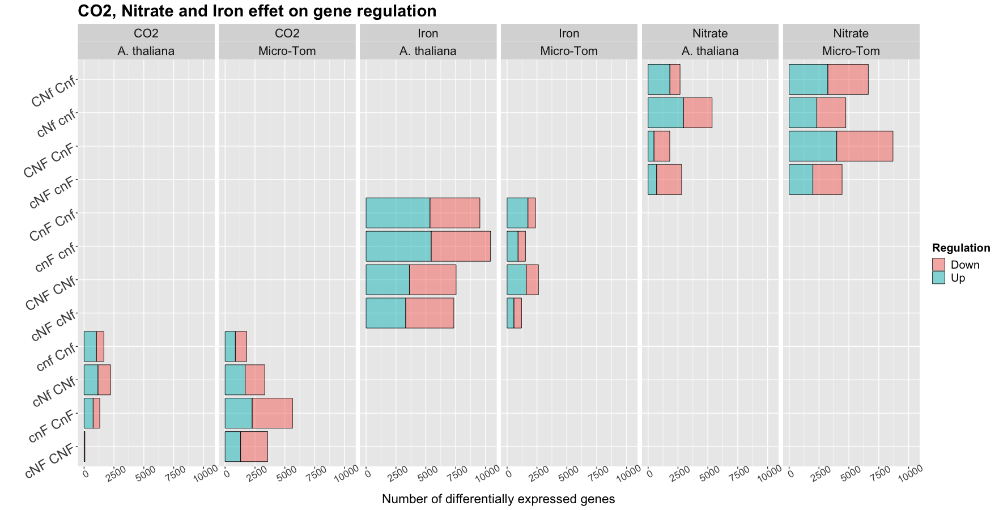
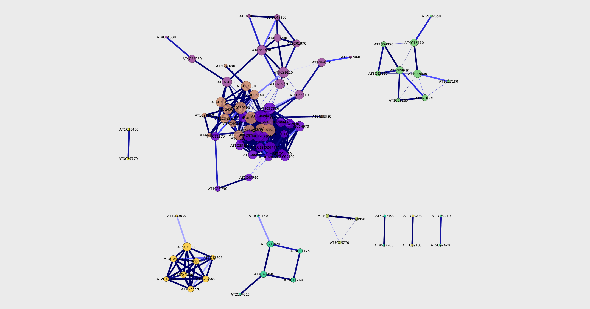

On cherche à étudier l'effet de trois facteurs sur le transcriptome des racines d'Arabidopsis thaliana et de la micro Tomate.

```{r knitr_init, echo=FALSE, cache=FALSE}
library(knitr, warn.conflicts = F, quietly = T)
library(rmdformats, warn.conflicts = F, quietly = T)

## Global options
options(max.print="75")
opts_chunk$set(cache=FALSE,
               prompt=FALSE,
               tidy=TRUE,
               comment=NA,
               message=FALSE,
               warning=FALSE,
               fig.align = "center")
opts_knit$set(width=75)
#setwd("~/Documents/CombinatoireFeNCO2/Combinatoire/")
setwd("./")
library(gridExtra)
library(reshape2)
library(PLNmodels)
library(corrplot)
suppressMessages(library(gridExtra, warn.conflicts = F, quietly = T))
suppressMessages(library(stringr, warn.conflicts = F, quietly = T))
suppressMessages(library(ggpubr, warn.conflicts = F, quietly = T))
suppressMessages(library(ggplot2, warn.conflicts = F, quietly = T))
suppressMessages(library(clusterProfiler, warn.conflicts = F, quietly = T))
suppressMessages(library(enrichplot, warn.conflicts = F, quietly = T))
suppressMessages(library(ggpubr, warn.conflicts = F, quietly = T))
suppressMessages(library(psych, warn.conflicts = F, quietly = T))
suppressMessages(library(igraph, warn.conflicts = F, quietly = T))
#self written functions for differential expression
source("./DEFunctions.R")
source("./Network_functions.R")
specie = "At"
```

# CO2

## Clustering

```{r cluster}
load(paste0("./GenesCO2_",specie,".RData"))


load("./normalized.count_At.RData")

#quantification file
data <- read.csv("quantifFiles/QuantifGenes.csv", h = T, sep = ',')
rownames(data) <- data$Gene
genes = which(!(grepl("__", rownames(data))))
not_quant = data[which((grepl("__", rownames(data)))),]
data = data[genes,grepl('R', colnames(data))]

keep <- rowSums(data) >= 10
data <- data[keep,]
group <- sapply(colnames(data), getLabel, with.rep = F)
colnames(data) <- sapply(colnames(data), getLabel)

specie = "At"
clusteredGenes <- clustering(sharedBy3, data)


a <- OntologyProfile(sharedBy3)
a$cluster <- clusteredGenes[a$ensembl_gene_id]
entrezID <- list()
nb_clust = max(clusteredGenes)
for (clust in seq(1:nb_clust)) {
    # print(entrez[entrez$cluster == clust,]$ensembl_transcript_id)
    entrezID[[length(entrezID) + 1]] <- na.omit(a[a$cluster == clust, ]$entrezgene_id)
}
names(entrezID) <- as.character(seq(1:nb_clust))

ck <- compareCluster(geneCluster = entrezID, fun = "enrichGO", OrgDb = org.At.tair.db, ont = "BP", pAdjustMethod = "BH", 
    pvalueCutoff = 0.01, qvalueCutoff = 0.05)
clusterProfiler::dotplot(ck, x = ~Cluster)


# On essaie un autre clustering avec lka librarie MPLN
#mpln (dataset = as.matrix(data[sharedBy3,]))
#beaucoup trop long, même mutlithreadé, c'est n'imp
```

Model-Based Clustering Using MPLN (Parallelized)
Description
Performs clustering using mixtures of multivariate Poisson-log normal (MPLN) distribution and model selection using AIC, AIC3, BIC and ICL. Since each component/cluster size (G) is independent from another, all Gs in the range to be tested have been parallelized to run on a seperate core using the parallel R package.


## Visualisation en ACP

```{r acp}

ACP(normalized.count[sharedBy3,], clusteredGenes)

```

On essaie avec une ACP basée sur modèle Poisson Log Normal, de PNLModels :


```{r acpPLN}


groups <- str_split_fixed(colnames(data), "_", 2)[,1]
co2 <- str_split_fixed(groups, "", 3)[,1]
nitrate <- factor(str_split_fixed(groups, "", 3)[,2])
nitrate <- relevel(nitrate, "N")
fer <- factor(str_split_fixed(groups, "", 3)[,3])
fer = relevel(fer, "F")
covariates <- data.frame(row.names =colnames(data), co2,nitrate, fer)


DEGenes <- sharedBy3
# preparation des données
counts <- round(t(data[DEGenes,]), 0)
plnData <- prepare_data(counts = counts, covariates = covariates)


PCA_models <- PLNPCA(
  Abundance ~ 1 + nitrate + fer + co2 + offset(log(Offset)),
  data  = plnData, 
  ranks = 1:10
); PCA_models;plot(PCA_models)
myPCA_ICL <- getBestModel(PCA_models, "ICL") 
plot(myPCA_ICL, ind_cols =groups, var_cols = factor(clusteredGenes[rownames(data[DEGenes,])]))

gridExtra::grid.arrange(
  plot(myPCA_ICL, ind_cols=groups, map = "individual", plot = FALSE),
  plot(myPCA_ICL, var_cols = factor(clusteredGenes[rownames(data[DEGenes,])]), map = "variable", plot = FALSE),
  ncol = 2
)

sigma(myPCA_ICL) %>% corrplot(is.corr = FALSE)

```

## Réseau 

```{r net}

log.data <- log2(normalized.count[sharedBy3,]+1)
Norm.interest.corr<-corr.test(t(log.data), method="pearson", ci=F)
Norm.interest.corr$p[lower.tri( Norm.interest.corr$p,diag=-TRUE)]=NA
Pval.adj<- as.data.frame(as.table(Norm.interest.corr$p))
Norm.interest.corr$r[lower.tri(Norm.interest.corr$r,diag=TRUE)]=NA
Correlation<-  as.data.frame(as.table(Norm.interest.corr$r))
Cor.table<- na.exclude(cbind( Correlation, Pval.adj))[,c(1,2,3,6)]
colnames(Cor.table)<- c("gene1","gene2","cor","p.adj")
Cor.table.filt<- Cor.table [(abs(Cor.table[,3])>0.9 & Cor.table[,4]<0.01 ),]

g<-  graph.data.frame(Cor.table.filt[,1:2],  directed=-FALSE)
V(g)$color <- clusteredGenes[V(g)]
Node_nw_st <- netStats(g)

plot.igraph(g, vertex.size = 5, vertex.label.cex = 0.3, color = clusteredGenes) 

#library(d3r)
# data_json <- d3_igraph(g)
# write(data_json, "data.json")

#write.table(Cor.table.filt, "GraphCO2.txt", sep="\t", row.names=F, quote=F)
#write.table(Node_nw_st,file="StatsCO2.txt", sep="\t", col.names = NA, quote=F)
```
## Réseau avec PLN Network

```{r plnCO2}

net_norm <- PLN_network(data = data, DEGenes = sharedBy3)

V(net_norm)$color <- clusteredGenes[V(net_norm)]
plot.igraph(net_norm, vertex.size = 10, vertex.label.cex = 0.5, edge.width = 0.5) 

Node_nw_st_pln <- netStats(net_norm)

length(E(net_norm))
length(E(g))

net <- net_norm
save(net, file = "CO2_igraph_network.RData")
```


# Nitrate

## Clustering
```{r nitrateClust}
load("GenesNitrate_At.RData")
clusteredGenes <- clustering(sharedBy3, data)

a <- OntologyProfile(sharedBy3)
a$cluster <- clusteredGenes[a$ensembl_gene_id]

entrezID <- list()
nb_clust = max(clusteredGenes)
for (clust in seq(1:nb_clust)) {
    # print(entrez[entrez$cluster == clust,]$ensembl_transcript_id)
    entrezID[[length(entrezID) + 1]] <- na.omit(a[a$cluster == clust, ]$entrezgene_id)
}
names(entrezID) <- as.character(seq(1:nb_clust))

ck <- compareCluster(geneCluster = entrezID, fun = "enrichGO", OrgDb = org.At.tair.db, ont = "BP", pAdjustMethod = "BH", 
    pvalueCutoff = 0.01, qvalueCutoff = 0.05)

clusterProfiler::dotplot(ck, x = ~Cluster)
```

## ACP
```{r nitrateACP}

ACP(normalized.count[sharedBy3,], clusteredGenes)


groups <- str_split_fixed(colnames(data), "_", 2)[,1]
co2 <- str_split_fixed(groups, "", 3)[,1]
nitrate <- factor(str_split_fixed(groups, "", 3)[,2])
nitrate <- relevel(nitrate, "N")
fer <- factor(str_split_fixed(groups, "", 3)[,3])
fer = relevel(fer, "F")
covariates <- data.frame(row.names =colnames(data), co2,nitrate, fer)

sample_genes <- sample(sharedBy3, 400)
DEGenes <- sample_genes
# preparation des données
counts <- round(t(data[DEGenes,]), 0)
plnData <- prepare_data(counts = counts, covariates = covariates)


PCA_models <- PLNPCA(
  Abundance ~ 1 + nitrate + fer + co2 + offset(log(Offset)),
  data  = plnData, 
  ranks = 1:10
); PCA_models;plot(PCA_models)
myPCA_ICL <- getBestModel(PCA_models, "ICL") 
plot(myPCA_ICL, ind_cols =groups, var_cols = factor(clusteredGenes[rownames(data[DEGenes,])]))

gridExtra::grid.arrange(
  plot(myPCA_ICL, ind_cols=groups, map = "individual", plot = FALSE),
  plot(myPCA_ICL, var_cols = factor(clusteredGenes[rownames(data[DEGenes,])]), map = "variable", plot = FALSE),
  ncol = 2
)

```

## Relevance network

```{r nitrateNet}
log.data <- log2(normalized.count[sharedBy3,]+1)

Norm.interest.corr<-corr.test(t(log.data), method="pearson", ci=F)
Norm.interest.corr$p[lower.tri( Norm.interest.corr$p,diag=-TRUE)]=NA
Pval.adj<- as.data.frame(as.table(Norm.interest.corr$p))
Norm.interest.corr$r[lower.tri(Norm.interest.corr$r,diag=TRUE)]=NA
Correlation<-  as.data.frame(as.table(Norm.interest.corr$r))
Cor.table<- na.exclude(cbind( Correlation, Pval.adj))[,c(1,2,3,6)]
colnames(Cor.table)<- c("gene1","gene2","cor","p.adj")
Cor.table.filt<- Cor.table [(abs(Cor.table[,3])>0.9 & Cor.table[,4]<0.01 ),]

g<-  graph.data.frame(  Cor.table.filt[,1:2],  directed=-FALSE)
V(g)$color <- clusteredGenes[V(g)]

netStats(g)
plot.igraph(g, vertex.size = 5, vertex.label.cex = 0.01, color = clusteredGenes) 
```

## PLN Ntework

```{r nitratePLN}
net <- PLN_network(data = data, DEGenes = sample_genes)

V(net)$color <- clusteredGenes[V(net)]
#V(net)$size <- degree[V(net)]*0.1
plot.igraph(net, vertex.size = 10, vertex.label.cex = 0.4, edge.width = 0.5) 

netStats(net)

save(net, file = "Nitrate_igraph_network.RData")


```

GENIE3 decomposes the prediction of a regulatory network between p genes into p different regression problems. In each of the regression problems, the expression pattern of one of the genes (target gene) is predicted from the expression patterns of all the other genes (input genes), using tree-based ensemble methods Random Forests or Extra-Trees. The importance of an input gene in the prediction of the target gene expression pattern is taken as an indication of a putative regulatory link. Putative regulatory links are then aggregated over all genes to provide a ranking of interactions from which the whole network is reconstructed.


dynGENIE3: dynamical GENIE3 for the inference of gene networks from time series expression data


# Iron

## Clustering
```{r ironClust}
load("GenesIron_At.RData")
clusteredGenes <- clustering(sharedBy3, data)
# a <- OntologyProfile(sharedBy3)
# a$cluster <- clusteredGenes[a$ensembl_gene_id]
# 
# entrezID <- list()
# nb_clust = max(clusteredGenes)
# for (clust in seq(1:nb_clust)) {
#     # print(entrez[entrez$cluster == clust,]$ensembl_transcript_id)
#     entrezID[[length(entrezID) + 1]] <- na.omit(a[a$cluster == clust, ]$entrezgene_id)
# }
# names(entrezID) <- as.character(seq(1:nb_clust))
# 
# ck <- compareCluster(geneCluster = entrezID, fun = "enrichGO", OrgDb = org.At.tair.db, ont = "BP", pAdjustMethod = "BH", 
#     pvalueCutoff = 0.01, qvalueCutoff = 0.05)
# 
# clusterProfiler::dotplot(ck, x = ~Cluster)

sample_genes <- sample(sharedBy3, 400)

groups <- str_split_fixed(colnames(data), "_", 2)[,1]
co2 <- str_split_fixed(groups, "", 3)[,1]
nitrate <- factor(str_split_fixed(groups, "", 3)[,2])
nitrate <- relevel(nitrate, "N")
fer <- factor(str_split_fixed(groups, "", 3)[,3])
fer = relevel(fer, "F")
covariates <- data.frame(row.names =colnames(data), co2,nitrate, fer)


DEGenes <- sample_genes
# preparation des données
counts <- round(t(data[DEGenes,]), 0)
plnData <- prepare_data(counts = counts, covariates = covariates)


PCA_models <- PLNPCA(
  Abundance ~ 1 + nitrate + fer + co2 + offset(log(Offset)),
  data  = plnData, 
  ranks = 1:10
); PCA_models;plot(PCA_models)
myPCA_ICL <- getBestModel(PCA_models, "ICL") 
plot(myPCA_ICL, ind_cols =groups, var_cols = factor(clusteredGenes[rownames(data[DEGenes,])]))

gridExtra::grid.arrange(
  plot(myPCA_ICL, ind_cols=groups, map = "individual", plot = FALSE),
  plot(myPCA_ICL, var_cols = factor(clusteredGenes[rownames(data[DEGenes,])]), map = "variable", plot = FALSE),
  ncol = 2
)

sigma(myPCA_ICL) %>% corrplot(is.corr = FALSE) 
```

## ACP
```{r ironACP}

ACP(normalized.count[sharedBy3,], clusteredGenes)
```

## Relevance network

```{r ironNet}
log.data <- log2(normalized.count[sample_genes,]+1)


Norm.interest.corr<-corr.test(t(log.data), method="pearson", ci=F)
Norm.interest.corr$p[lower.tri( Norm.interest.corr$p,diag=-TRUE)]=NA
Pval.adj<- as.data.frame(as.table(Norm.interest.corr$p))
Norm.interest.corr$r[lower.tri(Norm.interest.corr$r,diag=TRUE)]=NA
Correlation<-  as.data.frame(as.table(Norm.interest.corr$r))
Cor.table<- na.exclude(cbind( Correlation, Pval.adj))[,c(1,2,3,6)]
colnames(Cor.table)<- c("gene1","gene2","cor","p.adj")
Cor.table.filt<- Cor.table [(abs(Cor.table[,3])>0.9 & Cor.table[,4]<0.01 ),]

g<-  graph.data.frame(  Cor.table.filt[,1:2],  directed=-FALSE)
V(g)$color <- clusteredGenes[V(g)]


netStats(g)

plot.igraph(g, vertex.size = 5, vertex.label.cex = 0.01, color = clusteredGenes) 
```

## PLN Network


```{r ironPLN}
PLN_network(data = data, DEGenes = sample_genes)

net <- PLN_network(data = data, DEGenes = sample_genes)

V(net)$color <- clusteredGenes[V(net)]
#V(net)$size <- degree[V(net)]*0.1

plot.igraph(net, vertex.size = 10, vertex.label.cex = 0.4, edge.width = 0.5) 
netStats(net)
```


# Meeting summary Antoine Sophie


## Enquête sur la similarité entre cNF et CNF


- Corrélations entre les réplicats à l'intérieur d'une condition et de l'autre sont faiblement supérieures à celles entre cNF et CNF (images investigations factorCO2)


- Quand on compare CNF à une condition x et cNF à cette même condition x (6 conditions possibles pour x), on retrouve entre 40 et 70\% de gènes en commun, suggérant toute fois des différences entre ces deux transcritômes (on aurait presque 100\% de similarité sinon)


## Application des ces méthodes à la tomate

- La tomate semble répondre différemment dans certaines mesures : plus d'effet du CO2, effet moindre du fer, effet nitrate plutôt similaire.


- Ontologies moins fournies pour la tomate




## Relevance network sur les gènes qui répondent globalement à un facteur

- DEG en commun entre les 4 comparaisons possibles pour l'effet d'un facteur (Venn diagrams)


- Fait sur l'ensemble des transcriptômes (plus large que les transcriptômes sur lesquels les DEG ont été détectés)


- Relevance Network fait comme Rodrigo. et Al, seuil sur la valeur de corréation et sur la pvalue, gènes triés sur leur centralité et connectivité


- Visualisés dans igraph après Clustering


- Visualisés dans Cytoscape, pus clustering de communautés (pluggins) et analyse d'enrichissement d'ontologies



## Début de biblio sur les méthodes d'inférence de GRN

- **Regression**: Transcription factors are selected by target gene specific sparse linear regression and data resampling approaches.

- **Bayesian networks** optimize posterior probabilities by different heuristic searches.

- **Correlation** Edges are ranked based on variants of correlation.

- **Méthodes mixtes** Consensus entre différentes techniques (conclusion de la métanalyse et benchmarcks du projet DREAM5 (wisdom of crowds))

Others : Genie3: A random forest, neural networks, chi 2
- **Mutual Information**: Edges are (1) ranked based on variants of mutual information and (2) filtered for causal relationships.

GGM Inference Notes :

The better should be to infer one network per condition, but as data is scarce, we'd rather use all conditions for one network : multitask learning

Assumptions : 

- Few interaction : sparse adj matrix

- Networks are structured


Partial correlation : correlation between two genes knowing all the others. Indep ssi partial corr $= 0$.

The general principle is to optimize a likelihood function (probability of the data given a set of parameters $\Theta$) minus a penalty imposing the disered assumptions, tuned by $\lambda$ (kind of prior).
Penalty enables : regularisation for high number of genes, selection for sparsity, and model driven inference.


Cette function à optimiser peut varier : 

-MeinHousen and Bulhman (2006)

Si $X_i$ est un vecteur de $X$, alors on écrit $X_i = X_{\i}\beta + \epsilon$ On essaie de prédire l'expression d'un gène avec tous les autres, avec $\beta_j=- \frac{\theta_{ij}}{\theta_{ij}}$.


